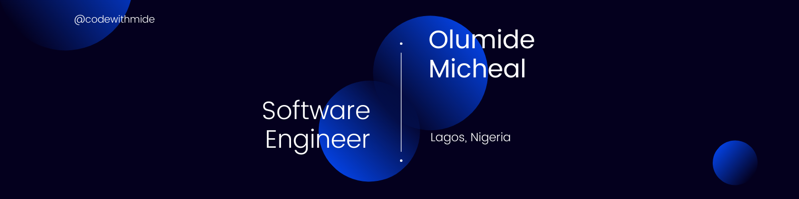

<h1 align="center">About Me</h1>

Hello there! I'm a **Software Engineer**, an **Open-source Advocate** and a **Technical Writer**. I'm thrilled to have you visit my GitHub profile. With my background in **Frontend Development**, I've worked on a variety of projects ranging from **small-scale applications** to **larger enterprise systems**. I'm always looking to learn and grow as a developer.

As an **open source advocate**, I also believe in the power of **collaboration** and **community** in the tech industry and I'm always looking for opportunities to collaborate on exciting open-source projects and contribute to the tech community.

In addition to my software development skills, I'm also a **technical writer**. My ability to communicate technical information in a clear and concise manner can add tremendous value to any software development project. Whether it's **creating user manuals**, **developer documentation**, or **writing technical blog posts**, I'm able to make complex technical information accessible and easy to understand for end-users and developers alike.

<h1 align="center">Open Source Collaborations</h1>
Here are some of the open source projects I've collaborated on:

- [I4G-OPENSOURCE-FRONTEND-PROJECT](https://github.com/Ingressive-for-Good/I4G-OPENSOURCE-FRONTEND-PROJECT-2022): Collaborated with fellow maintainers by reviewing submitted PRs, raise issues and provide documentations such as the readme, code of conduct and contribution guide for contributors.
- [I4G-OPENSOURCE-BACKEND-PROJECT](https://github.com/Ingressive-for-Good/I4G-OPENSOURCE-FRONTEND-PROJECT-2022): Assisted in providing documentations including readme, code of conduct and contribution guide for contributors.
- [OPENSOURCE-UNIZIK](https://github.com/nworiekingslee/Open-source-Unizik): Made my first contribution to an open source repository. Thanks to [Nworie Kingsley](https://github.com/nworiekingslee)

<h1 align="center">Technical Articles</h1>

- [Securing Your Server with Certbot](https://codewithmide.hashnode.dev/securing-your-server-with-certbot-a-step-by-step-guide-to-easy-ssl-installation): Here I provided a step-by-step guide to an easy SSL installation on your server.
- [*Args and **Kwargs in Python](https://codewithmide.hashnode.dev/args-and-kwargs-in-python): Having troubles understanding the args and kwargs keywords in python? Kindly read the article to get a better understanding.
- [What happens when you type google.com in your browser and press Enter?](https://medium.com/@olumidemicheal7/what-happens-when-you-type-google-com-in-your-browser-and-press-enter-8523aa662dbd): Have you ever wondered about what happens behind the scene when communicating with your browser? This article provides a clear guide.

<h1 align="center">Technology Tools and Stack</h1>

<div align="center">


</div>

<h1 align="center">Wakatime Streak</h1>

<!--START_SECTION:waka-->

```text
JavaScript   19 hrs 49 mins  ████████████████████████▓   98.53 %
JSON         9 mins          ▒░░░░░░░░░░░░░░░░░░░░░░░░   00.76 %
CSS          7 mins          ░░░░░░░░░░░░░░░░░░░░░░░░░   00.62 %
Other        1 min           ░░░░░░░░░░░░░░░░░░░░░░░░░   00.09 %
```

<!--END_SECTION:waka-->

<h1 align="center">Github Streak</h1>

<div align="center">


[](https://git.io/streak-stats)

</div>

<h1 align="center">Connect with me</h1>

<p align="center">
<a href="https://codepen.io/olumidemicheal" target="blank"></a>
<a href="https://dev.to/kingmide1" target="blank"></a>
<a href="https://twitter.com/olumidemicheal_" target="blank"></a>
<a href="https://linkedin.com/in/olumide-micheal-650b001b2" target="blank"></a>
<a href="https://stackoverflow.com/users/15599045" target="blank"></a>
<a href="https://hashnode.com/@codewithmide" target="blank"></a>
<a href="https://medium.com/@olumidemicheal7" target="blank"></a>
</p>

<!--  -->

[](https://holopin.io/@codewithmide2)
